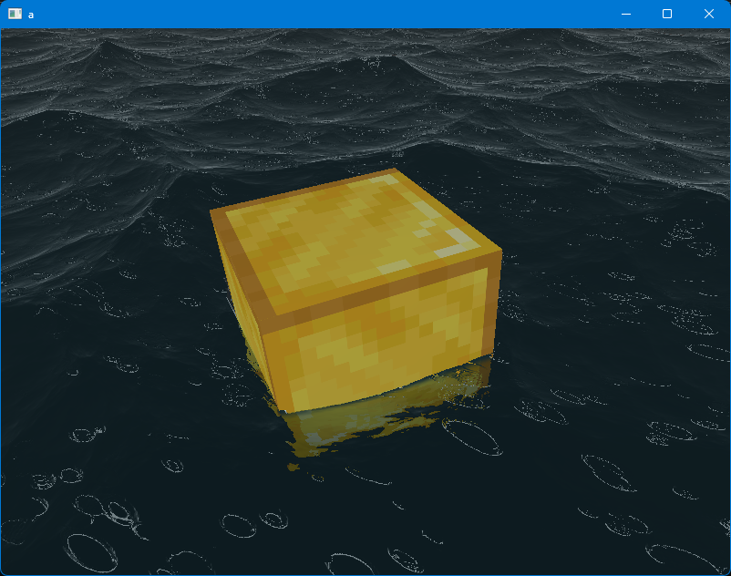
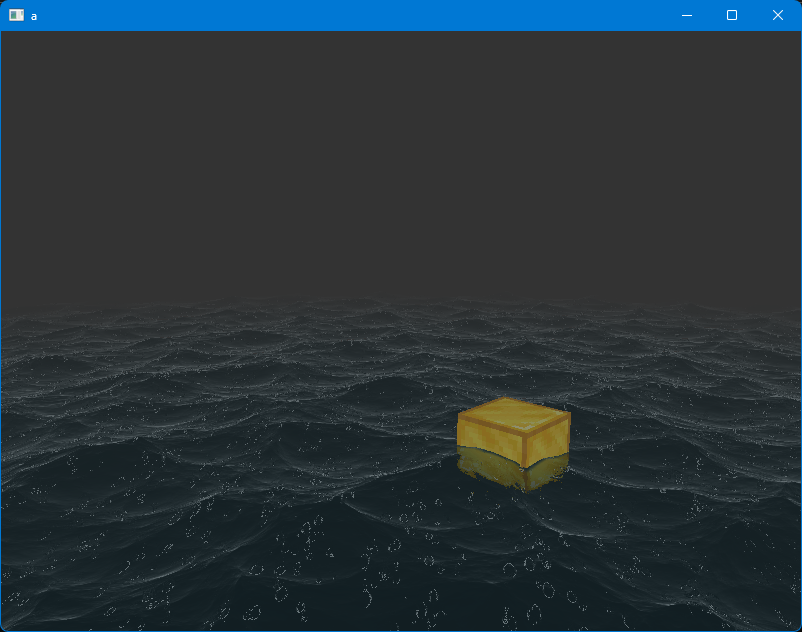
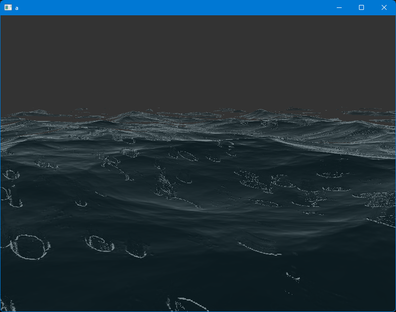

# 🌊 OpenGL Ocean

一个基于 OpenGL 的实时海洋渲染与波浪模拟项目


---

## ✨ 功能特性

| 模块 | 描述 |
|------|------|
| 🌊 **波浪模拟** | 基于 Ray Marching 的多层正弦波叠加算法，实时动态水面 |
| 🌅 **天空盒** | 六面全景立方体贴图，营造真实天际氛围 |
| 💡 **光照系统** | 方向光 / 点光源 / 聚光灯 三光源协同渲染 |
| 🎨 **材质系统** | 支持漫反射、镜面反射、法线贴图等多种材质属性 |
| 🎥 **自由相机** | WASD 移动 + 鼠标视角，可切换光标模式 |
| 🔊 **音效系统** | 海浪、雨声等环境音（SDL2_mixer） |
| 🏝️ **场景物体** | 容器、方块、模型等可交互物体 |

---

## 🖼️ 预览

| | |
|:-------------------------:|:-------------------------:|
|  |  |
| 海浪与天空盒 | 光照与材质渲染 |
|  |  |
| 自由视角漫游 |  |

---

## 🛠️ 技术栈

- **图形 API**：OpenGL 3.3 + GLEW + GLFW
- **数学库**：GLM
- **图像加载**：SDL2_image
- **音频**：SDL2_mixer
- **着色器**：GLSL（Vertex / Fragment Shader）
- **开发语言**：C++

---

## 🎮 操作指南

| 按键 | 功能 |
|------|------|
| `W` `A` `S` `D` | 相机移动 |
| `鼠标移动` | 旋转视角 |
| `ESC` | 切换鼠标光标 / 退出 |
---

## 📦 项目结构

```
OpenGL-ocean/
├── 源.cpp              # 主程序入口与渲染循环
├── Camera.cpp/h        # 相机系统
├── Shader.cpp/h        # 着色器封装
├── Mesh.cpp/h          # 网格数据
├── Model.cpp/h         # 模型加载
├── Material.h          # 材质系统
├── Light*.cpp/h        # 三种光源实现
├── Music.h             # 音效模块
├── water.vert/.frag    # 水面着色器（核心）
├── planeVertex.vert    # 平面着色器
├── rain.frag           # 雨效着色器
├── bin/                # 运行时资源（纹理/音频/DLL）
│   ├── Sea/            # 海浪纹理与音频
│   ├── universSky/     # 天空盒六面图
│   ├── noise/          # 噪声纹理
│   └── *.dll           # Windows 运行库
└── view/               # 项目宣传图片
```

---

## 🚀 快速开始

### Windows（已提供预编译）

直接运行根目录下的 `Main.exe` 即可。

### 自行编译

```bash
# 依赖：OpenGL、GLEW、GLFW、SDL2、SDL2_image、SDL2_mixer、GLM
# 使用 Visual Studio / CMake / MinGW 编译 源.cpp 及相关 .cpp 文件
# 链接：glew32s glfw3 SDL2 SDL2_image SDL2_mixer opengl32
```

---

## 📄 License

[MIT License](LICENSE) © sheeepsoup

---

## ⭐ 支持

如果你觉得这个项目不错，欢迎在 GitHub 上点个 Star ⭐

[](https://github.com/sheeepsoup/OpenGL-ocean/stargazers)
[](https://github.com/sheeepsoup/OpenGL-ocean/releases)

**项目地址**：https://github.com/sheeepsoup/OpenGL-ocean/
